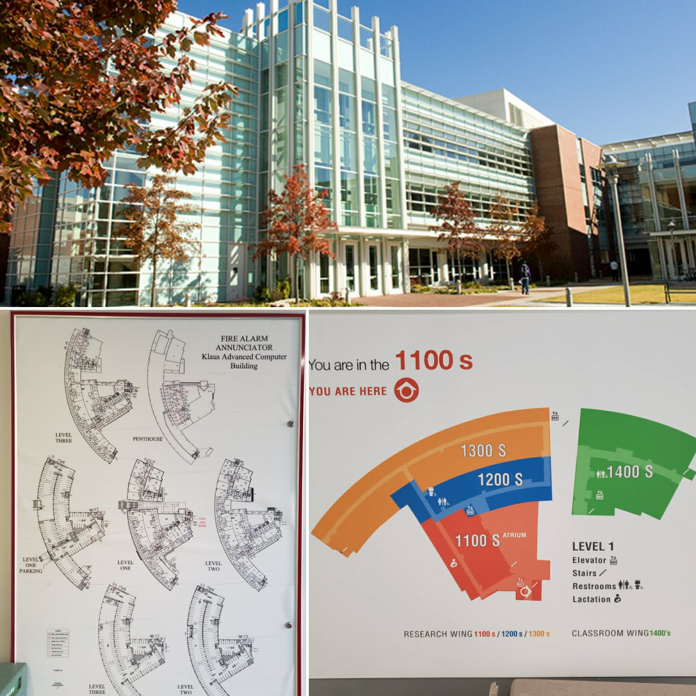

# Topics

## Detailed Design Document Overview

## Detailed Design Document Part 1: Front Matter and Terminology
* Cover Page: include all relevant information
* TOC and Table of figures
* Terminology
* Using MS Word
    * Using styles and why...
    * How to insert Table of Contents and figures
    * Inserting page breaks
    * enter vs shift Enter
* Sample Detailed Design.docx

## Detailed Design Document Part 2: System Architecture

* High level view of your system
* Must have a static and dynamic view
* cs3312_DetailDesign.pdf & DetailedDesignReport-2019-9-28.pptx
* It's a good idea to whiteboard your architecture before creating your diagrams for the document.
* Let's work through an team's architecture (or look at examples)

## ReadMe - release 0.1.0
* End goal is a complete Release Notes for version 1.0.0
* Example: [Seed & Lead Impact App README.md](https://github.com/harrisonrsmth/SLI-App-H-Brans-1104/blob/main/README.md)
* [Nerd Fonts README](https://github.com/ryanoasis/nerd-fonts#readme)
* What's your favorite README? OR README feature?

# Readings
* [Design Docs at Google](https://www.industrialempathy.com/posts/design-docs-at-google/)
* Shore, Chapter 9, "[Incremental Design and Architecture](www.jamesshore.com/v2/books/aoad1/incremental_design), and “[Simple Design](http://www.jamesshore.com/v2/books/aoad1/simple_design)”

# Resources
* [(video) What Is A Design Doc In Software Engineering? (full example) - Clément Mihailescu](https://youtu.be/bgHL41e7vgI)
* [Awesome READMEs](https://github.com/matiassingers/awesome-readme)
* Alred, “Layout and design” (310-316)
* Alred, “Formal Reports” (196-218)

# Upcoming Assignments
* Gallup Strengths assessment before class on 1/28/22.[Gallup Strengths assessment](https://gatech.gallup.com)
* (down edited) Meeting Agenda - Week 3
* Detailed Design - Front Matter / Introduction + Terminology
* Sprint 1 Demo Video
